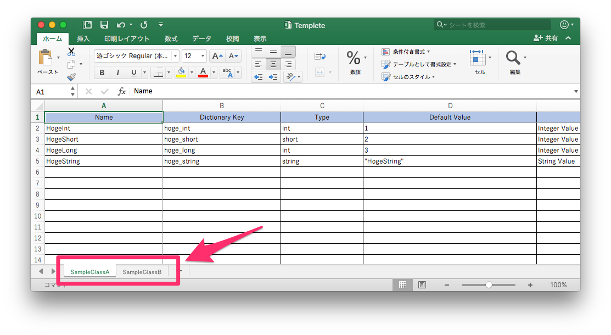

## Description

Generate a C# source code from xlsx file.

Generated source code gives

* Property
* Serialize to System.Collections.Generic.Dictionary\<K,V\> instance 
* De-Serialize from System.Collections.Generic.Dictionary\<K,V\>

## Use situation

* General C# programing (e.g. Make a HTTP request/response header)
* Using WWW and WWWForm class in Unity (e.g. Make a HTTP request/.response header, form values)

## System requirements

* Python 2.x 3.x
* xlrd (python module) [http://pypi.python.org/pypi/xlrd](http://pypi.python.org/pypi/xlrd)

## How to install xlrd

`pip install xlrd`
see also [http://pypi.python.org/pypi/xlrd](http://pypi.python.org/pypi/xlrd)

## Usage

`python Excel2CSDictionary.py <namespace> <xlsx filename> <output-dir>`

* namespace:  Generated C# namespace
* xlsx filename: source of Excel file (*.xlsx)
* output-dir: Output directory which generated C# file

**NOTE: C# class Name == spreadsheet's name**

### Command example

`python Excel2CSDictionary.py com.example.myapp Template.xlsx`

## XLSX file format

Use a Template.xlsx

## License

See "LICENSE" file.
